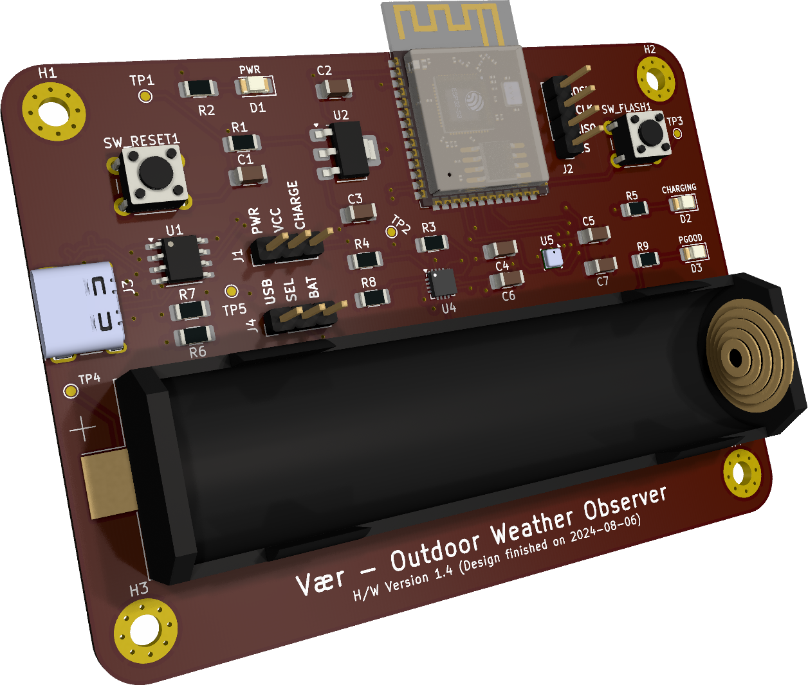

# Vær

Vær (_Norwegian for weather_) is a combination of a PCB (_Printed Circuit Board_) as well as the corresponding firmware for it for measuring the current weather conditions.
The whole project is a low-power-optimized and can be used with a small solar panel for increased battery life.

## Repository Structure

* **[`app_backend`](app_backend/)**: The backend which is used by the iOS app to fetch collected weather data
* **[`board`](board/)**: The PCB design for the project created with [KiCad](https://www.kicad.org/)
* **[`firmware`](firmware/)**: The firmware for the PCB which does the actual work of collecting the data

## Board

